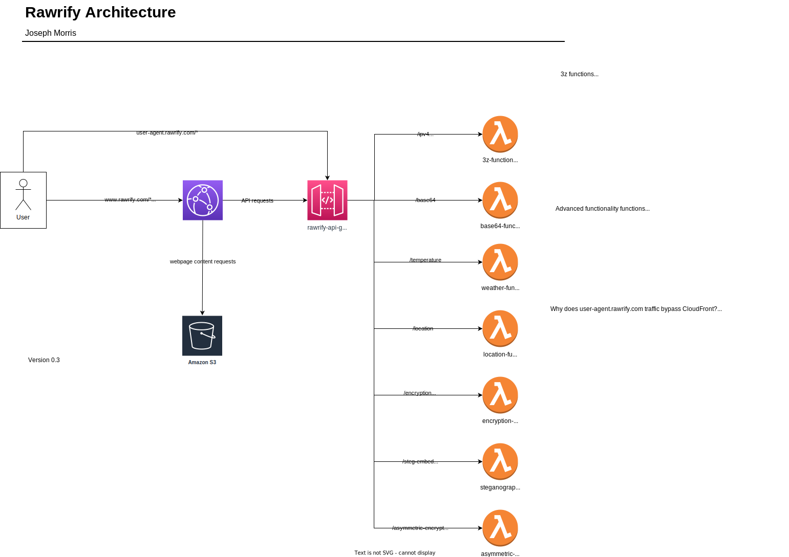

    #######################################
     _____                     _  __
    |  __ \                   (_)/ _|
    | |__) |__ ___      ___ __ _| |_ _   _
    |  _  // _` \ \ /\ / / '__| |  _| | | |
    | | \ \ (_| |\ V  V /| |  | | | | |_| |
    |_|  \_\__,_| \_/\_/ |_|  |_|_|  \__, |
                                      __/ |
                                     |___/
    #######################################

# Rawrify
### An ultra-lightweight general utility API
### Created and maintained by @Han-Lon

## What is it?
Simply put, Rawrify is an ultra-lightweight general purpose API that you can use for
things like getting your public IPv4 address, quickly encoding files/strings as base64, and so on.

## How do I use it?
[Refer to the wiki for instructions.](https://github.com/Han-Lon/rawrify/wiki) 
The rest of this README are for the infrastructure and app code that support Rawrify.

## Architecture Diagram

## Feature Roadmap
- v0.3 (TBD)
  - Steganographic functions
  - Asymmetric encryption/decryption
- v0.2
  - Symmetric encryption/decryption
  - Use [CloudFront custom headers](https://docs.aws.amazon.com/AmazonCloudFront/latest/DeveloperGuide/using-cloudfront-headers.html) to add more client-relevant information 
  - Better error handling
  - Fix issue with etag in Terraform code causing unnecessary changes for every apply
- v0.1
  - IPv4, IPv6, and user agent lookup
  - Base64 encoding/decoding
  - Temperature/weather lookup for latitude/longitude location using Weather.gov API